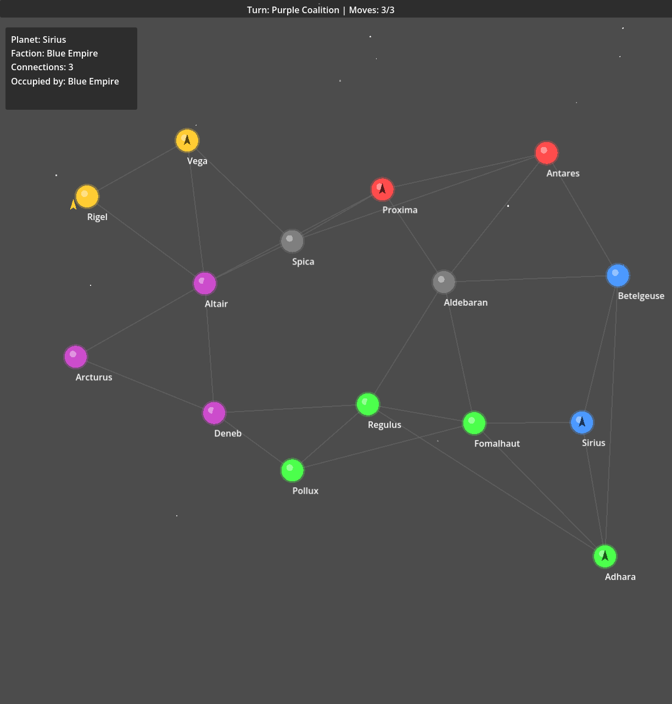

# Conquest — 2D Space Strategy (Godot 4.6.2)

A turn-based space strategy game inspired by Galactic Civilizations. Navigate star systems connected by travel lanes, command fleets, and expand your empire.

## Features

- **Turn-Based System**: Each faction gets 3 ship moves per turn
- **Galaxy Map**: Procedurally generated planets with travel lanes
- **Home Planets**: Each faction starts with exactly one planet (their home) - all other planets are neutral. Home planets are preferably at least two lanes apart, but all 5 factions are guaranteed a home planet.
- **Node-based Movement**: Ships travel along predefined hyperlanes between planets
- **Multiple Factions**: 5 color-coded empires (Player + 4 AI factions)
- **AI Opponents**: AI factions make moves automatically on their turns
- **Fleet Management**: Select and command ships to move between connected planets
- **Camera Controls**: Pan (right-click drag) and zoom (mouse wheel)

## How to Play

1. Open the project in Godot 4.6.2
2. Main scene: [scenes/Main.tscn](scenes/Main.tscn)
3. **Your Turn**: Click your ships (blue) to select them
4. Click connected planets (with visible lanes) to order movement
5. Each faction gets **3 moves per turn**
6. Ships that have moved become darker/grayed out
7. Click **"End Turn"** when finished to pass to next faction
8. AI factions will automatically move their ships
9. Click planets to view info (faction, connections)

## Controls

- **Left Click**: Select ships or planets
- **Right Click + Drag**: Pan camera
- **Mouse Wheel**: Zoom in/out
- **End Turn Button**: Complete your turn and pass to next faction

## Gameplay

- **Movement Limit**: 3 ship moves per faction per turn
- **Turn Order**: Player Empire → Red Dominion → Green Alliance → Purple Coalition → Yellow Consortium
- **Visual Feedback**: Ships darken when they've moved in the current turn
- **AI Strategy**: AI factions move ships to random connected planets

## Project Structure

- `scenes/` - Scene files (Main, Planet, Ship, GalaxyMap, etc.)
- `scripts/` - GDScript files for game logic
- `project.godot` - Godot project configuration

## Next Steps

- Add combat system when fleets meet
- Implement resource gathering and production
- Add turn-based mechanics or real-time strategy
- Create faction AI for enemy movements
- Add tech tree and ship upgrades
